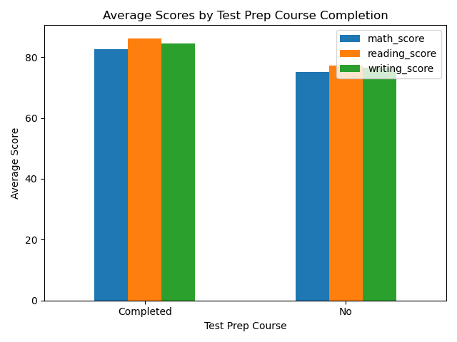

# Student Exam Performance Analysis

A small data analysis project exploring what factors are associated with student exam
performance — inspired by my background as a maths teacher, now applied with Python and
Pandas.

## Dataset
60 students, with: gender, parental education level, whether they completed a test prep
course, weekly study hours, and scores in math, reading, and writing (0-100).

## Tools
Python, Pandas, Matplotlib

## Key Findings

**1. Completing a test prep course is associated with meaningfully higher scores.**
Students who completed test prep scored roughly 7-9 points higher on average across all
three subjects (e.g. math: 82.6 vs 75.1).

**2. Higher parental education level generally aligns with higher scores, but not perfectly.**
There's a clear upward trend from "High School" to "Master's Degree," but "Associate's
Degree" students actually scored highest in math — a reminder that real data rarely shows
perfectly clean patterns, especially in a smaller dataset like this one (60 students).

**3. Study hours are moderately correlated with performance (~0.6 across all subjects).**
More study time is genuinely associated with better scores, but it's clearly not the only
factor at play — a correlation of 0.6 is meaningful, not absolute.

## A note on a real gotcha I ran into
While grouping by test prep status, one group silently disappeared from my results. The
cause: Pandas automatically treats certain text values (like the word "None") as missing
data by default, so an entire group was being dropped without any error or warning. I fixed
it by renaming the value to something unambiguous ("No"). A good reminder to always sanity-check
group counts before trusting a summary.

## What I'd do next
- Pull in a larger, real public dataset to see if these patterns hold up at scale
- Explore combinations of factors together (e.g. test prep + study hours) rather than one at a time
